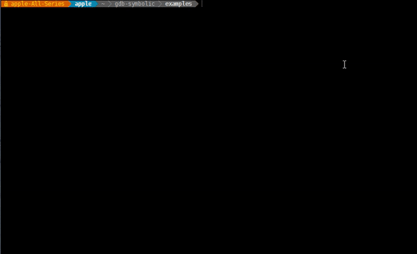
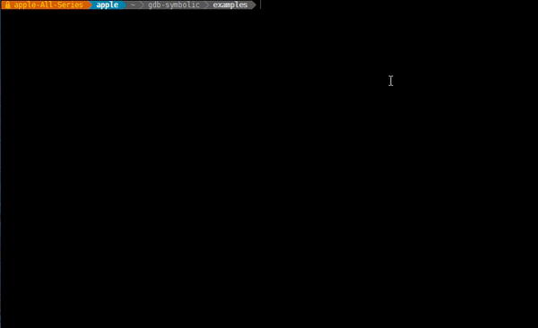

# gdb symbolic

gdb-symbolic - symbolic execution extention for gdb

# Installation

**Warning!!! Installation script will overwrite your gdb**

**Due to python3 not supported for triton yet**

**Need to recompile gdb for python2**

```bash
./install.sh
echo "source ~/gdb-symbolic/gdb-symbolic.py" >> ~/.gdbinit
```

# Commands

## symbolize

Make symbolic

### options

- argv
- memory [address] [size]

## target

Set target address

## triton

Run symbolic execution

## answer 

Print symbolic variables 

## debug

Show debug message

### options

- symbolic
- gdb

# Examples

You could combine with other gdb plugin, such as [peda](https://github.com/longld/peda).

## crackme hash 32



## symbolize argv


## crackme hash 64



# Tests

```bash
./tests/run.sh
```
